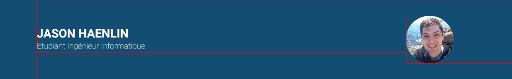
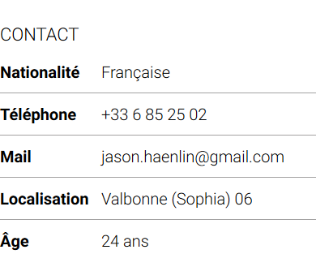

# My resume in HTML and CSS

## Author : Jason HAENLIN

## Github : <https://github.com/JasonHaenlin/my-resume-webpage>

## Deployment : <https://otakedev.com/jasonhaenlin>

### Relevant information

#### Naming convention

Just so you know, I used the **BEM** (Block Element Modifier) naming convention to structure my css classes.

For example, `item` and `item__title` means that `item__title` is nested in a `item` class. It much more easier to read et to reuse the css with that convention. Also in `item--bottom-line`, the '--' is used when we use a modifier for a class. In this example, we take the class `item` and we had a modifier `--bottom-line`.

#### Header part

On the header I used a `flex Container` to display the header title and subtitle on the same column and the image on an other column



```css
.flex-container {
    display: flex;
    flex-flow: row wrap;
}

.flex-container--col1 {
    flex: 1 1 auto;
}

.flex-container--col4 {
    flex: 4 1 auto;
}

@media (max-width: 1100px) {
    .flex-container {
        justify-content: center;
    }
}
```

#### Main sections parts

##### the Sections

I used a `flex container` to make the two section of my main sections.

```css
.main {
    display: flex;
    background-color: var(--clear);
    z-index: 8;
}

.main>.section:nth-child(1) {
    width: 40%;
    box-shadow: 3px -6px 13px var(--grayB);
}

.main>.section:nth-child(2) {
    width: 55%;
}
```

Also, like you can notice, I used a `z-index` to put this container bellow the other, to achieve that, I needed to add a `relative position` in my header. That way, I created a new **Stacking context** and was able to manage which one was above and bellow. I needed to do that to hide the `box-shadow` on the top of the main container.

##### the left part

I had some issue to justify my text properly



```css
.item__title {
    font-weight: bold;
}

.item__title--justify {
    display: inline-block;
    width: 6em;
}
```

To achieve that, It was necessary to add a modifier on my Block with `display: inline-block` because, I used a `<span>` to put all the element on the same row, but at default, a span don't have a width or height because, it's `inline`. Like that, I was able to put the same width on all the title and have something cleaner.

I have also used a `::before` to add a bottom line on each element.
I had to do something tricky to be able to use the `width: 100%` because it take the **Stacking context** max width, so I had to put a `relative position` on my `item` class.

```css
.item--bottom-line::before {
    position: absolute;
    height: 1px;
    width: 100%;
    background-color: var(--grayB);
    content: "";
    bottom: -0.5em;
}
```

For the progress bar, I used a simple svg with a mask to change the level of the bar.

```html
    <svg>
        <defs>
            <mask id="progress100">
                <rect width="100%" height="100%" x="-0%" y="0"
                    fill="#fff" />
            </mask>
            <!-- other masks from 90 to 20 -->
            <mask id="progress10">
                <rect width="100%" height="100%" x="-20%" y="0"
                    fill="#fff" />
            </mask>
        </defs>
        <rect class="background" width="100%" height="100%" rx="2" />
        <g mask="url(#progress90)">
            <rect class="fill" width="100%" height="100%" rx="2" />
        </g>
    </svg>
```

##### the right part


To display properly the information, I used a `grid container` to structure my elements.

```css
.card {
    display: grid;
    grid-template-columns: 1fr 10em;
    grid-template-rows: minmax(2em, auto) minmax(3em, auto);
    grid-template-areas:
        "title period"
        "description description";
}

.card__title {
    grid-area: title;
}

.card__period {
    grid-area: period;
}

.card__description {
    grid-area: description;
}
```

Also the Circle on the timeline is just a `<div class="timeline-circle"></div>` with a `relative position` to move the circle on the left.

```css
.timeline-circle {
    position: relative;
    right: 1em;
    height: 2em;
    width: 2em;
    border: 0.5em solid var(--grayB);
    border-radius: 50%;
    background-color: var(--blue1);
    float: left;
}
```
